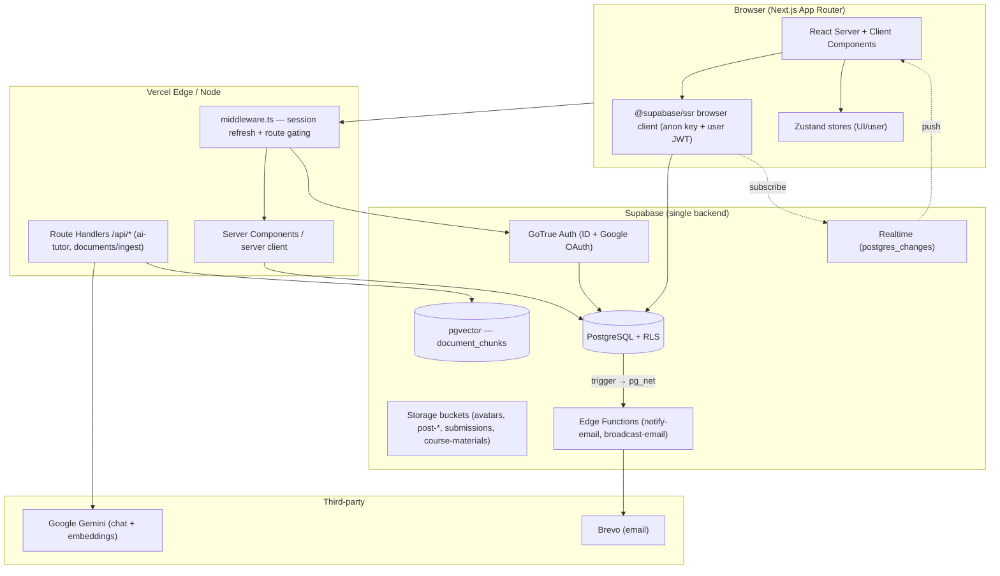
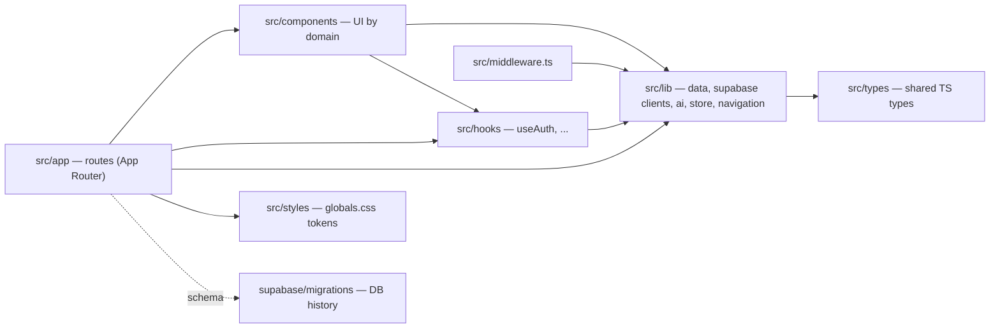
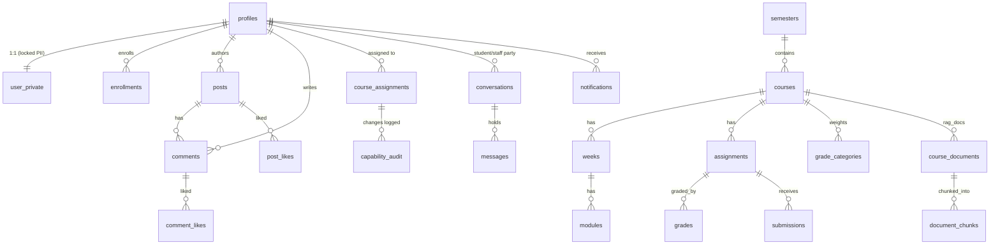
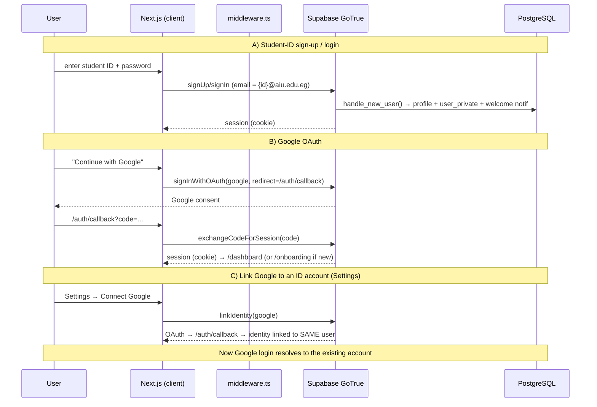
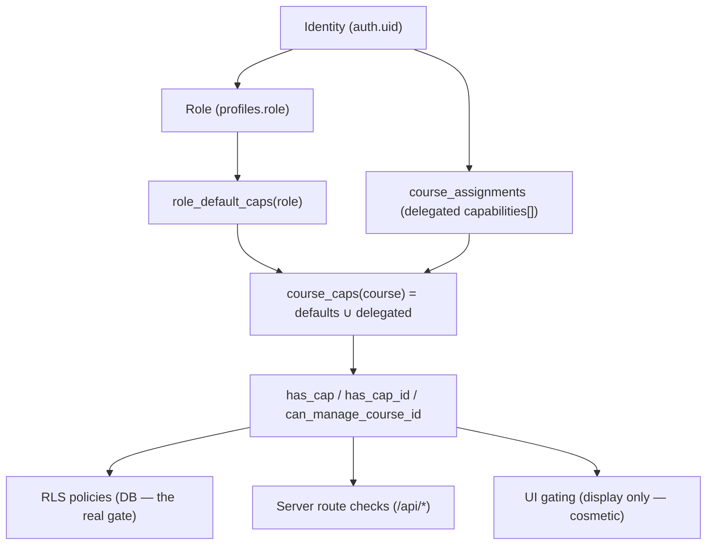
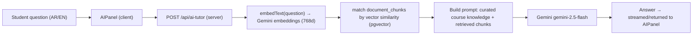
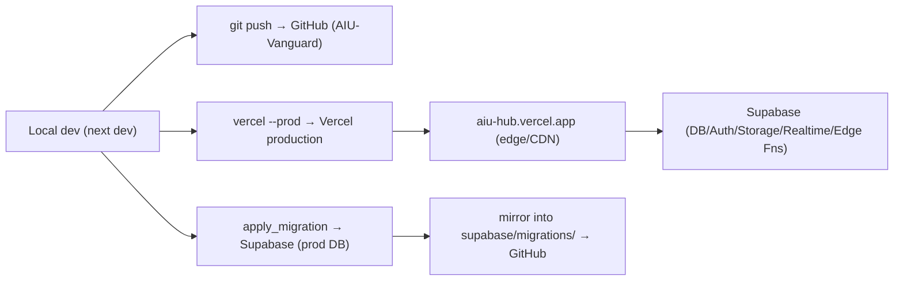

<!--
  AIU VANGUARD — THE PROJECT BIBLE
  Official engineering documentation. Written to be presented to FAANG interviewers,
  CTOs, investors, and senior engineers — and to onboard a team that continues the work.
-->

# 🛡️ AIU Vanguard — The Project Bible

> **The complete engineering documentation for AIU Vanguard (AIU Hub)** — an AI‑powered
> Learning Management Platform for Computer Science students at **Alamein International
> University**. This document is the single source of truth: architecture, database,
> security, flows, decisions, trade‑offs, and a from‑zero rebuild guide.

| | |
|---|---|
| **Product** | AIU Vanguard — bilingual (Egyptian Arabic + English) LMS |
| **Live** | https://aiu-hub.vercel.app |
| **Source** | github.com/elserafyyousef1-lgtm/AIU-Vanguard |
| **Author** | Yousef Mahmoud Elserafy |
| **Status** | v1.0 — live in production |
| **Stack** | Next.js 14 · TypeScript · Supabase (PostgreSQL + RLS + Storage + Realtime + Edge Functions) · Google Gemini · Brevo · Vercel |

---

## Table of Contents

1. [Executive Summary](#1-executive-summary)
2. [Project Story](#2-project-story)
3. [Product Overview](#3-product-overview)
4. [System Architecture](#4-system-architecture)
5. [Architecture Decision Records (ADR)](#5-architecture-decision-records-adr)
6. [Folder‑by‑Folder Explanation](#6-folder-by-folder-explanation)
7. Database Documentation *(continued below in later sections)*
8. Security · 9. Authentication Flow · 10. Authorization Flow
11. AI System · 12. APIs · 13. Frontend · 14. Backend
15. Performance · 16. Deployment · 17. Challenges · 18. Features Timeline
19. Technical Debt · 20. Scalability · 21. Testing · 22. Codebase Walkthrough
23. Design Decisions · 24. Roadmap · 25. Interview Questions · 26. Knowledge Check
27. Glossary · 28. Final Evaluation · 29. Rebuild Guide · 30. Appendix

> **Note on completeness:** this file is authored in ordered passes. Sections **1–6** are
> below in full; sections **7–30** are appended in subsequent commits. Every claim is drawn
> from the actual codebase (`src/`, `supabase/migrations/`) and live database.

---

# 1. Executive Summary

## What is this project?
**AIU Vanguard** is a production **Learning Management System (LMS)** built for the Computer
Science program at **Alamein International University (AIU)**. It gives students a single,
fast, beautiful place to study their real curriculum — course materials, worked examples,
mock exams, a **bilingual AI tutor trained on the actual syllabus**, grades, a class
community, and direct messaging with staff — while giving instructors (doctors, masters,
teaching assistants) and administrators **capability‑scoped control** over the courses they
own.

## Why was it built?
University course material at AIU was scattered across chat groups, PDFs, and word of mouth.
There was no single, trustworthy, *searchable*, exam‑focused home for a course. AIU Vanguard
was built to be that home — **"every lecture, every exam trap, every formula, engineered
into one platform, with an AI tutor trained on your exact syllabus."**

## What problem does it solve?
| Pain (before) | Solution (AIU Vanguard) |
|---|---|
| Material scattered across WhatsApp/Drive | One structured platform, per‑course, per‑semester |
| No exam‑oriented practice | Mock exams, practice sets, flashcards, worked solutions |
| Generic AI answers that ignore the syllabus | An AI tutor grounded on the course's own content (RAG + curated knowledge) |
| No clear teaching hierarchy or delegation | Capability‑based roles (owner → admin → doctor → master → guider → student) |
| No safe place for class discussion | Per‑course community feeds + student↔staff messaging |
| Announcements missed | Realtime in‑app notifications **+** email fallback when offline |

## Who are the users?
- **Students** — study, enroll, practice, ask the AI tutor, discuss, message staff, track grades.
- **Doctors (course instructors)** — request to teach, manage content, publish assignments, grade — *within their delegated capabilities*.
- **Masters / Guiders (TAs)** — delegated subsets of course power (e.g. media, grading, posting).
- **Admins** — manage people, roles, and courses.
- **Owner** — the super‑admin; full control, the only one who can grant admin.

## Vision
A scalable, secure, **Canvas‑grade** academic platform where *identity → role → course
assignment → capabilities → UI* is enforced end‑to‑end, the database is the source of truth,
and the experience feels like a top‑tier product on both laptop and phone.

## Current status
**v1.0, live in production** on `aiu-hub.vercel.app`, source on GitHub, database on Supabase.
It has real users across all roles, a hardened security posture (RLS everywhere, security
headers, storage scoping, edge‑function secrets), and a working AI tutor, community,
messaging, notifications, and a University‑Requirements course track with a draft/publish
workflow.

## Future roadmap (teaser — full roadmap in §24)
Automated test suite · rate limiting · private course‑materials bucket with signed URLs ·
richer AI (streaming, multi‑turn memory) · analytics · mobile app shell · per‑track curricula.

---

# 2. Project Story

> A chronological account of how AIU Vanguard evolved — reconstructed from the codebase and
> the git history (`git log`).

## 2.1 The origin
It started as a **single‑course study package** (the "study‑package era" — traces remain in
early copy that was later removed) — essentially a rich set of notes + an AI helper for one
course. The realization: the *platform* was more valuable than the package. The project
pivoted from "a study pack" into "**the platform every CS course lives in.**"

## 2.2 From package → platform (the first big pivot)
The data model generalized from *one course* to **8 semesters → many courses → weeks →
modules**, all **DB‑driven** so that adding a course to a semester "lights it up"
automatically with zero code changes. Landing‑page copy was rewritten from study‑package
language to **platform‑level** language ("The elite rise here").

## 2.3 Identity, roles, and the Canvas moment
As instructors and TAs entered the picture, a flat "staff vs student" model wasn't enough.
The project adopted a **capability‑based authorization system** modeled on Canvas:
*Identity → Role → Course Assignment → Capabilities → UI*, with **RLS as the source of
truth** and the UI merely reflecting server‑enforced permissions. Delegation (owner assigns
a TA specific powers on a specific course), an **immutable audit log**, capability
**expiry**, and capability **presets** followed.

## 2.4 Content, correctness, and the ML duplicate
Real course content was authored (Machine Learning, Database Systems, Differential Equations,
Computer Networks) with **pre‑rendered KaTeX** math (rendered at build time, not in the
browser). A key correctness episode: a **duplicated ML course** (CSE301 vs AIE121) — seeded
partly with test data — was cleaned up "doing the right thing," collapsing to the single
real course.

## 2.5 Hardening passes (RC → security → CTO sign‑off)
The project went through disciplined release passes:
- **Release‑Candidate hardening** — search‑path locking on SECURITY DEFINER functions,
  RLS `initplan` optimization (`auth.uid()` → `(select auth.uid())`), FK covering indexes.
- **Penetration testing** — an early harness produced *false positives* (counting HTTP‑403
  error bodies as "1 row = success"); the methodology was corrected to be **status‑aware**,
  re‑run, and confirmed **0 real vulnerabilities**. Genuine issues found and fixed along the
  way: a stored‑XSS via profile social links (fixed with a DB `CHECK` constraint **and** a
  render‑time guard), an SSRF vector in the RAG ingest route (fixed with a host allow‑list),
  and an avatars‑bucket defacement vector (fixed by folder‑scoping).
- **Independent CTO review** → **v1.0 sign‑off** and launch; source pushed to GitHub.

## 2.6 The University Requirements track (a first‑class entity)
The most significant recent evolution: turning "University Requirements" (the online,
general‑education courses AIU students take across the whole program) into a **first‑class,
DB‑backed course category** — but **hidden from students by default**. This forced a proper
**draft/publish** model: a `published` flag on `courses`, RLS so students only see published
courses, and cascading hardening so a draft course's **content, AI documents, and enrollment**
can't leak either. Notifications were re‑pointed to fire **on publish, not on insert**, so
building future courses never spams students.

## 2.7 Product & design maturity
Later passes focused on **product polish**: a distinct visual identity for the Requirements
track, a tactile `card-lift` design‑system utility, motion/perf hardening
(`prefers-reduced-motion`), skeleton loaders, the **real AIU curriculum** (sourced from the
university's official study‑plan PDF) on the semester cards, a **scalable community course
selector**, a **Courses hub** that browses all semesters, and a secure **"Connect Google"**
account‑linking flow to solve the ID‑vs‑Google duplicate‑account problem.

## 2.8 Lessons that shaped the architecture
- **Never trust the client** — every gate is re‑enforced by RLS on the database.
- **Status‑aware verification** — a 403 is *blocked*, not a success; always interpret HTTP status.
- **Suppress side effects during seeding** — bulk‑inserting courses must not fire notification/email triggers.
- **Publish transitions, not inserts** — announce things when they become *visible*, not when they're *created*.
- **Defense in depth** — a DB `CHECK` constraint *and* a render guard; RLS *and* folder‑scoping.

---

# 3. Product Overview

Every feature, why it exists, and its value.

| Feature | What it does | Why it exists | User value |
|---|---|---|---|
| **Semester grid** | DB‑driven grid of the 8‑semester CS program + a University Requirements track | A structured, scalable map of the whole degree | Students see the program at a glance; active semesters open, upcoming ones preview their real subjects |
| **Courses** (e.g. CSE221, AIE121, MAT312, CSE311) | Rich course pages: lectures, materials (weeks/modules), mock exams, flashcards, AI tutor | The core study surface | Everything for a course in one place |
| **University Requirements** | Online general‑ed courses as real, owner‑managed courses, **hidden until published** | AIU students take these across the program; the owner opens them when ready | A complete, honest program view; drafts stay private |
| **AI Tutor (Vanguard AI)** | Bilingual (AR/EN) chat grounded on course knowledge + RAG over uploaded materials | Generic LLMs ignore the syllabus | Answers that match *this* course, fast (~3s) |
| **Community** | Per‑course + general feeds: posts, comments, replies, likes, images, PDFs, YouTube | A safe, on‑topic class discussion space | Announcements + peer discussion, per course |
| **Messaging** | Student ↔ staff direct messages, with **email fallback** when offline | Private questions to instructors | Reachable even offline (Brevo email) |
| **Notifications** | Realtime in‑app (bell + sound) **+** email — likes, comments, replies, messages, promotions, new material, grades, new course on publish | Users must never miss important events | World‑class awareness; email when away |
| **Role dashboards** | Workflow‑oriented hubs per role (Student/Doctor/Master/Guider/Admin/Owner) | Each role has a different job | "What do I do next" surfaced per role |
| **Capabilities & delegation** | Owner assigns a user specific powers on a specific course; audited; expirable; presets | Real teaching orgs delegate | Canvas‑style least‑privilege control |
| **Grades & GPA** | Published‑assignment grades → per‑course finals → a math GPA | Track standing | Deterministic, DB‑computed (never AI) |
| **Profiles** | Avatar, gallery, certificates, bio, social links (LinkedIn/GitHub) | Identity + portfolio | A shareable academic profile |
| **Connect Google** | Link a Google identity to the same ID account (OAuth‑verified) | ID users adding a Gmail were creating duplicate accounts | One account, one‑tap Google login |
| **Settings** | Name, nickname, private contact (phone/email), notification prefs, sign‑in methods | Account management | Control over identity + reachability |

### Educational value
The platform is itself a **teaching artifact**: it demonstrates production‑grade RLS,
capability‑based authorization, RAG, realtime, and a draft/publish content workflow — the
exact patterns a CS student should learn to build real systems.

---

# 4. System Architecture

AIU Vanguard is a **serverless, database‑centric** application: a Next.js front end talks
almost entirely to **Supabase**, and **Row‑Level Security (RLS) on PostgreSQL is the security
boundary** — not a hand‑written API tier. This is the single most important architectural
fact about the system.



## 4.1 Layers

| Layer | Technology | Responsibility |
|---|---|---|
| **Frontend** | Next.js 14 App Router, TypeScript, React (server + client components) | UI, routing, rendering |
| **State** | Zustand (`src/lib/store.ts`, `notificationStore.ts`) | Client UI state, user settings, tab‑wide notification singleton |
| **Styling** | CSS variables/design tokens (`src/styles/globals.css`) + inline styles | Obsidian+Crimson theme, light/dark, responsive |
| **Auth** | Supabase GoTrue (email/ID + Google OAuth), `@supabase/ssr` | Identity, sessions (cookie‑based), OAuth, identity linking |
| **Authorization** | PostgreSQL RLS + capability functions | The real permission boundary |
| **Database** | Supabase PostgreSQL | All app data; RLS; triggers; SECURITY DEFINER functions |
| **Storage** | Supabase Storage (5 buckets) | Avatars, post images/files, submissions, course materials |
| **Realtime** | Supabase Realtime (`postgres_changes`) | Live notifications, community, messages |
| **AI** | Google Gemini + pgvector RAG | Course‑grounded tutor |
| **Email** | Brevo via Supabase Edge Functions | Notification + broadcast email |
| **Middleware** | `src/middleware.ts` | Session refresh + login gating for protected routes |
| **API routes** | `src/app/api/*` | The *few* things that need a server secret (Gemini key, PDF ingest) |
| **Deployment** | Vercel (front end + edge) + Supabase (backend) | Hosting, CDN, functions |

## 4.2 Rendering strategy (SSR vs CSR)
- **Server Components** render static/first‑paint shells (e.g. the course page fetches the
  course row server‑side via the server Supabase client, then hands off to a client component).
- **Client Components** (`'use client'`) own anything interactive or realtime — the semester
  grid, community, messages, dashboards, settings — reading via the browser Supabase client
  where **RLS still enforces every query with the user's JWT**.
- **The homepage grid and `/courses` are DB‑driven client components**: they fetch `semesters`
  + `courses` and render; adding a course in the DB updates the UI with no deploy.

## 4.3 Request & data flow (typical read)
1. A client component calls `supabase.from('table').select(...)` with the **anon key + the
   user's JWT** (from the cookie).
2. PostgREST executes the query **as the `authenticated` role**; **RLS policies** filter rows
   using `auth.uid()` and capability functions.
3. Only authorized rows return. There is **no application code** that can be tricked into
   returning unauthorized data — the DB is the gate.

## 4.4 Request flow (privileged action, e.g. AI tutor)
1. Client calls a **Route Handler** `POST /api/ai-tutor`.
2. The handler runs on the server with the **service context / server secret** (Gemini key
   from env — never shipped to the client), does RAG retrieval over `document_chunks`, calls
   Gemini, and streams/returns the answer.

## 4.5 Why "no backend"?
The "backend" is **PostgreSQL itself** — RLS policies, `SECURITY DEFINER` functions, triggers,
and a handful of Edge Functions. This collapses an entire API tier into the database, removes
a class of authorization bugs (you can't forget an auth check on an endpoint that doesn't
exist), and scales with Postgres. See ADR‑002.

---

# 5. Architecture Decision Records (ADR)

Each ADR: **Problem → Options → Decision → Trade‑offs → Future.**

### ADR‑001 — Next.js 14 App Router (over Pages Router / SPA / other frameworks)
- **Problem:** need SSR for fast first paint + SEO on public pages, plus rich client interactivity.
- **Options:** CRA/Vite SPA; Next.js Pages Router; Next.js App Router; Remix.
- **Decision:** **App Router** — server components for shells, client components for interactivity, file‑based routing, Route Handlers for the few server secrets, first‑class Vercel deploy.
- **Trade‑offs:** ✅ SSR+CSR in one model, great DX, Vercel‑native. ⚠️ App Router complexity; server/client boundary discipline required. The project leans heavily on client components + RLS, so it uses a fraction of App Router's server power (see Tech Debt §19).
- **Future:** migrate SiteNav to a single root‑layout instance (removes the nav‑auth snapshot debt).

### ADR‑002 — Supabase + RLS as the backend (over a custom Node/Express API)
- **Problem:** need auth, a relational DB, storage, realtime, and authorization — fast, by a solo builder.
- **Options:** custom Express/Nest API + Postgres + Redis + S3 + a WebSocket layer; Firebase; **Supabase**.
- **Decision:** **Supabase** with **RLS as the authorization layer**. One provider gives Postgres, GoTrue auth, Storage, Realtime, and Edge Functions; RLS enforces permissions **in the database**.
- **Trade‑offs:** ✅ Enormous surface removed; auth bugs structurally reduced ("no endpoint to forget a check on"); one mental model. ⚠️ RLS is subtle (policy‑ordering, `SECURITY DEFINER`, function‑execute grants — see the `anon`/`can_manage_course_id` regression in §17); vendor coupling.
- **Future:** if needed, Postgres is portable; the RLS + functions move with it.

### ADR‑003 — Capability‑based authorization (over role‑only checks)
- **Problem:** "doctor" vs "student" is too coarse; real teaching delegates *specific* powers on *specific* courses (grade this course, post here, manage media there).
- **Options:** hard‑coded role checks; a permissions matrix in app code; **capabilities in the DB**.
- **Decision:** `course_assignments.capabilities text[]` (delegated) layered over `role_default_caps(role)`; resolved by `course_caps()` / `has_cap()` / `has_cap_id()` and consumed by RLS. Changes are written via a `set_course_capabilities()` RPC and recorded in an **immutable `capability_audit`**.
- **Trade‑offs:** ✅ Least privilege; Canvas‑grade delegation; auditable; expirable; presets. ⚠️ More concepts to learn; capability resolution must be correct in every policy.
- **Future:** capability **groups**/templates; time‑boxed grants surfaced in UI.

### ADR‑004 — Draft/Publish visibility via a `courses.published` flag + RLS (over app‑side hiding)
- **Problem:** University‑Requirement (and future) courses must exist for the owner to build, but stay **invisible to students** until ready.
- **Options:** hide in the UI only; a separate `draft_courses` table; a `published` boolean gated by RLS.
- **Decision:** **`published boolean default true`** on `courses` + a rewritten `courses_read` policy (students/anon see only published; owner/admin/managers see all). Content tables (`weeks`, `modules`, `document_chunks`, `course_documents`) and `enrollments` were hardened to **follow course visibility**, so a draft's material/AI‑docs/enrollment can't leak.
- **Why not app‑side hiding?** The project's rule is **RLS is truth**; UI hiding is bypassable via a forged REST call.
- **Trade‑offs:** ✅ One flag = enforcement across grid, course page, `/semesters/[id]`, community, AI, search; default `true` = zero regression for existing courses. ⚠️ Every course‑reading path had to be audited for consistency.
- **Future:** scheduled publish; per‑section visibility.

### ADR‑005 — Notify on **publish transition**, not on insert
- **Problem:** the `notify_new_course` trigger fired on every `INSERT`, so seeding/building draft courses would spam every student with notifications + emails.
- **Decision:** the trigger now fires only when a course **becomes visible** — a brand‑new *published* course, or a draft flipped to published (`AFTER INSERT OR UPDATE`, guarded by `NEW.published AND (INSERT OR OLD.published=false)`).
- **Trade‑offs:** ✅ Zero spam while building; the announcement lands at the correct moment. ⚠️ Slightly more trigger logic.

### ADR‑006 — Hybrid session (fast `getSession()` for display, RLS + middleware for enforcement)
- **Problem:** calling `getUser()` (a network validation) on every page mount added 240ms–1.5s of latency.
- **Decision:** read the cookie locally with `getSession()` for **display identity only** (~0ms); **every data query is still RLS‑enforced with the JWT**, and `middleware.ts` gates protected routes. A per‑tab **nav‑auth snapshot** keeps the nav from flickering to guest links during revalidation.
- **Trade‑offs:** ✅ Instant navigation; security unchanged (RLS/middleware enforce). ⚠️ The snapshot is display‑only tech debt tied to per‑page SiteNav (§19).

### ADR‑007 — Secure account linking via `linkIdentity` (over auto‑merging by email)
- **Problem:** a student who signs up by ID, then saves a Gmail in Settings, then "Login with Google," got a **brand‑new empty account**.
- **Options:** auto‑merge accounts by the typed contact email; do nothing; **user‑initiated OAuth linking**.
- **Decision:** a **"Connect Google"** button in Settings runs `supabase.auth.linkIdentity({ provider:'google' })`; OAuth **proves ownership**, then Google login resolves to the *same* account.
- **Why not auto‑merge?** The contact email is **unverified** — auto‑linking it would let anyone hijack an account by typing a victim's email. The one‑time OAuth click is the secure proof.
- **Trade‑offs:** ✅ Secure, standard (GitHub/Notion‑style "connect account"). ⚠️ Requires Supabase **Manual Linking** enabled (an owner toggle) and one user click.

### ADR‑008 — Pre‑rendered KaTeX at build time (over client‑side math rendering)
- **Problem:** rendering hundreds of formulas in the browser is slow and janky.
- **Decision:** render `$…$` / `$$…$$` to HTML **at build time** with `katex.renderToString`, ship static HTML, and inject it via `dangerouslySetInnerHTML` (**author‑controlled static content only** — never user input).
- **Trade‑offs:** ✅ Instant math, no client KaTeX cost. ⚠️ A build step; content lives in generated data files.

### ADR‑009 — Email via Supabase Edge Functions + Brevo, triggered by DB (over an app mailer)
- **Problem:** notifications must reach users **when offline**, and must never leak secrets to the client.
- **Decision:** a DB trigger (`on_notification_email`) calls an **Edge Function** (`notify-email`) via `pg_net`; the function reads the recipient with the service role, picks a **deliverable** address (contact_email > a real non‑`@aiu.edu.eg` Google email; synthetic IDs are skipped), and sends via **Brevo**. A second function (`broadcast-email`) sends brand‑designed announcements. Both are protected by a **shared webhook secret**.
- **Trade‑offs:** ✅ Secrets stay server‑side; idempotent (`email_sent_at`); the DB is the trigger. ⚠️ Async delivery; Brevo dependency.

### ADR‑010 — Inline styles + CSS‑variable design tokens (over a CSS framework/CSS‑in‑JS lib)
- **Decision:** a rich **design‑token layer** in `globals.css` (radii, easing, shadows, fonts, an Obsidian+Crimson palette, light/dark) with **component‑level inline styles** for layout, plus a few utility classes (`card-lift`, `skeleton`, `glass`, `btn-*`).
- **Trade‑offs:** ✅ Zero runtime CSS‑in‑JS cost; tokens keep it consistent and theme‑aware. ⚠️ Inline styles can't express `:hover`/`:focus` (utilities fill the gap); more verbose than a framework (§19).

---

# 6. Folder‑by‑Folder Explanation



**Dependency direction:** `app` → `components` → `lib`; `hooks` and `types` are leaf‑ish
shared deps. Nothing in `lib` imports from `components`/`app` (keeps data/logic reusable).

| Path | Responsibility | Notes |
|---|---|---|
| `src/app/` | **Routes** (App Router). Each folder = a route; `page.tsx` renders it. | `/` (landing + grid), `/courses` (hub), `/courses/[slug]` (+ `/modules`, `/assignments`, `/gradebook`), `/semesters/[id]`, `/community` (+ `/[course]`), `/messages`, `/dashboard`, `/admin` (+ `/people`), `/settings`, `/profile/[id]`, `/login`, `/onboarding`, `/auth/callback`, `/api/*`, `/dev/*`. |
| `src/app/api/` | **Route Handlers** — the only server‑secret code. | `ai-tutor/route.ts` (Gemini), `documents/ingest/route.ts` (PDF → chunks → embeddings, with SSRF guard). |
| `src/app/auth/callback/` | OAuth landing — exchanges the code for a session cookie. | Used by Google sign‑in **and** `linkIdentity`. |
| `src/components/` | **UI by domain.** | `layout/` (SiteNav, SemestersGrid, Hero, Showcase), `course/` (CourseClient, LecturesTab, ExamTab, FlashcardsTab, modules/gradebook UI), `community/` (CommunityView), `dashboard/` (StudentHub, DoctorHub, MasterHub, GuiderHub, AdminHub, CourseModal, StudentCenter), `ai/` (VanguardAI, AIPanel), `ui/` (NotificationBell, CommandPalette, SettingsPanel, Card, ErrorReporterMount, WelcomeModal, RoleGuide). |
| `src/lib/` | **Data + logic (no UI).** | `data/` (static course content: `courses.ts`, `aie121*`, `cse221*`, `mat312*`), `supabase/` (browser `client.ts`, server `server.ts`, `middleware.ts` session), `ai/` (`embeddings.ts`, `chunk.ts`), `store.ts` (Zustand), `notificationStore.ts` (tab‑wide singleton), `navigation.ts` (single nav source of truth), `sound.ts`, `errorReporter.ts`, `z.ts` (z‑index scale). |
| `src/hooks/` | React hooks. | `useAuth.ts` — the central "who am I + what can I do" hook. |
| `src/types/` | Shared TypeScript types. | `Course`, `Semester`, `UserRole`, `Post`, etc. |
| `src/styles/globals.css` | **Design tokens + base + utilities.** | Palette, radii, easing, shadows, fonts, `card-lift`, `skeleton`, `glass`, `btn-*`, reduced‑motion, app shell + nav CSS. |
| `src/middleware.ts` | Session refresh + **route gating** (redirect to `/login` for protected paths). | Matcher covers everything except static assets. |
| `supabase/migrations/` | **DB history** — every schema/RLS/trigger/function change, mirrored from what was applied to production. | The database's source of truth. |
| `handover/`, `*.md` | Handover notes + this documentation. | — |

---

---

# 7. Database Documentation

PostgreSQL is the heart of the system. This section documents the schema, relationships,
policies, triggers, functions, and the reasoning behind them.

## 7.1 Entity–Relationship (core)



## 7.2 Tables (by domain)

**Identity & access**
| Table | Key columns | Purpose |
|---|---|---|
| `profiles` | `id` (=auth.users.id), `full_name`, `nickname`, `role` (enum), `avatar_url`, `semester`, `settings` (jsonb), `bio`, `linkedin`, `github`, `certificates`, `bio_images` | Public‑ish user record; `role` drives defaults. |
| `user_private` | `user_id`, `student_id`, `phone`, `contact_email` | **Locked PII** — read only via the `my_contact` RPC; written via `update_my_contact`. |
| `course_assignments` | `user_id`, `course`, `role_in_course`, `capabilities text[]`, `expires_at`, `reason` | Delegated per‑course powers. |
| `capability_audit` | `id`, actor, target, course, before/after caps, reason, `created_at` | **Immutable** log (a trigger blocks UPDATE/DELETE). |

**Academic structure**
| Table | Key columns | Purpose |
|---|---|---|
| `semesters` | `id` (int PK), `title` | 8 CS semesters + `id=9` "University Requirements". |
| `courses` | `id`, `code` (unique), `title`, `semester_id` (FK), `subtitle`, `description`, `instructor`, `credit_hours`, `color`, `icon`, `tags[]`, `has_ai`, `has_formulas`, `order_index`, `grade_scale`, **`published`** | The course entity; `published` gates visibility. |
| `weeks` | `id`, `course_id` (FK), `title`, `order_index` | Content grouping. |
| `modules` | `id`, `week_id` (FK), `title`, `type` (enum `module_type`), `file_url`, `body`, `order_index`, `created_by` | Lecture/file/link/video/quiz/assignment items. |
| `enrollments` | `id`, `user_id`, `course` (code), `completed`, `section`, `enrolled_at` | Student ↔ course; 24h self‑cancel window. |

**Assessment**
| Table | Key columns | Purpose |
|---|---|---|
| `assignments` | `id`, `course_id`, `category_id`, `title`, `kind`, `max_points`, `submission_type`, `available_at`, `due_at`, **`published`** | Graded work; hidden until published. |
| `grade_categories` | `id`, `course_id`, `weight_percent` | Weighted grade buckets. |
| `grades` | `id`, `student_id`, `assignment_id`, `score` | Per‑assignment scores. |
| `submissions` | `id`, `student_id`, `assignment_id`, … | Student uploads (private bucket). |

**Social & messaging**
| Table | Key columns | Purpose |
|---|---|---|
| `posts` | `id`, `user_id`, `content`, `course_tag`, `image_url`, `file_urls`, `video_url` | Community posts (general or per‑course). |
| `comments` | `id`, `post_id`, `user_id`, `content`, `reply_to` | Threaded comments. |
| `post_likes` / `comment_likes` | `(post/comment)_id`, `user_id` | Likes. |
| `conversations` | `id`, `student_id`, `staff_id`, unique(student,staff) | Student↔staff DM thread. |
| `messages` | `id`, `conversation_id`, `sender_id`, `content`, `image_url`, `read_at` | DM messages. |

**Notifications & AI & ops**
| Table | Key columns | Purpose |
|---|---|---|
| `notifications` | `id`, `user_id`, `actor_id`, `type`, `post_id`, `comment_id`, `conversation_id`, `meta`, `read_at`, `email_sent_at` | In‑app + email fan‑out. |
| `course_documents` | `id`, `course`, `title`, `file_url`, `status`, `chunk_count` | Uploaded RAG source docs. |
| `document_chunks` | `id`, `document_id`, `course`, `content`, `embedding vector(768)`, `chunk_index` | RAG retrieval units. |
| `app_errors` | client error reports (deduped, capped) | Lightweight error monitoring. |

## 7.3 Enums
- `user_role`: `owner · admin · doctor · master · guider · student` (+ `rep` referenced in some notify targets).
- `module_type`: `file · link · video · quiz · assignment`.

## 7.4 Key functions
| Function | Kind | Role |
|---|---|---|
| `current_user_role()` | SECURITY DEFINER, `search_path=public` | `select role from profiles where id = auth.uid()`. |
| `role_default_caps(role)` | pure | Default capabilities per role. |
| `course_caps(course)` / `has_cap(course, cap)` / `has_cap_id(course_id, cap)` | resolver | Merge delegated + default caps; used **inside RLS**. |
| `can_manage_course_id(id)` | `= has_cap_id(id, 'structure')` | "can manage this course". |
| `set_course_capabilities(...)` | SECURITY INVOKER | Writes caps + sets `app.cap_reason`; audited by trigger. |
| `my_final_grades()` / `course_final_grades(id)` | reporting | Weighted finals from **published** assignments only. |
| `my_contact()` / `update_my_contact(...)` | RPC | Read/write locked `user_private`. |
| `handle_new_user()` | trigger fn | On signup: create profile + user_private + a one‑time `welcome` notification; owner bootstrap by student_id. |
| `notify_*()` (promotion, new_material, new_course, grade_released, message, comment, post_like, teach_*, enroll_*, new_semester, profile_edited) | trigger fns | Create notifications on events; `notify_new_course` fires on **publish**, not insert. |
| `on_notification_email()` | trigger fn | For emailable types, `pg_net` → `notify-email` Edge Function. |
| `internal_config(key)` | SECURITY DEFINER | Reads a server secret (webhook secret) for Edge Functions. |

## 7.5 Triggers (selection)
`on_role_change_notify` (profiles) · `on_new_material_notify` (modules) · `on_new_course_notify`
(courses, INSERT+UPDATE, publish‑gated) · `on_grade_released` (grades) · `on_message_notify` /
`on_new_message` (messages) · `on_comment_notify` (comments) · `on_post_like_notify` (post_likes) ·
`on_new_post_notify` (posts) · `on_notification_email` (notifications → email) ·
`on_capability_change_audit` (course_assignments → capability_audit) ·
`capability_audit_no_edit` (blocks UPDATE/DELETE on the audit) · `handle_new_user` (auth.users).

## 7.6 Normalization, naming, performance
- **Normalized** (3NF‑ish): entities separated (courses/weeks/modules; posts/comments/likes);
  PII isolated in `user_private`. Denormalized only where it pays (e.g. `notifications.meta`).
- **Naming:** snake_case tables/columns; `<verb>_<noun>` trigger functions; `on_<event>` triggers.
- **Performance:** RLS predicates wrap `auth.uid()` as `(select auth.uid())` (the **initplan**
  optimization — evaluated once per query, not per row); **FK covering indexes** added; the
  courses table is tiny so `published`‑gated reads are trivial. See §15.
- **Future:** partial index on `courses(published)`; materialized GPA; archival of old notifications.

---

# 8. Security Documentation

> Threat philosophy: **the client is hostile; the database is the wall.** Every UI gate is
> re‑enforced by RLS. UI role checks are *display only*.

## 8.1 Controls (summary)
| Area | Control |
|---|---|
| **AuthN** | Supabase GoTrue; ID (email/password over a synthetic `@aiu.edu.eg`) + Google OAuth (PKCE); cookie sessions via `@supabase/ssr`. |
| **AuthZ** | **RLS on every table** + capability functions; `middleware.ts` route gating; UI gating is cosmetic. |
| **Roles/Capabilities** | 6 roles + delegated `capabilities[]` + defaults; immutable audit; expiry. |
| **Headers** | CSP (`frame-ancestors 'none'; base-uri 'self'; form-action 'self'; object-src 'none'`), `X-Frame-Options: DENY`, `X-Content-Type-Options: nosniff`, `Referrer-Policy`, `Permissions-Policy`. |
| **XSS** | React/JSX auto‑escapes all user content; `dangerouslySetInnerHTML` used **only** for author‑controlled, build‑time static course HTML. |
| **SQL injection** | No string‑built SQL with user input; PostgREST parameterizes; RLS bounds every query. |
| **SSRF** | The RAG ingest route validates `fileUrl` against an **allow‑list** (must be `https`, the Supabase storage host, `/storage/` path). |
| **Stored‑data injection** | Profile social links constrained by DB `CHECK` regex (`linkedin.com` / `github.com` https‑only) **and** a render‑time `safeUrl()` guard. |
| **Storage** | `submissions` **private** + per‑user folder; `avatars` locked to the user's own folder (INSERT/UPDATE); post buckets staff‑write. |
| **Secrets** | Only `NEXT_PUBLIC_*` (anon key + URL — public by design) reach the client; service role + Gemini + Brevo + webhook secret are server‑only. |
| **Edge functions** | `notify-email` / `broadcast-email` require a shared `x-webhook-secret` (return **403** otherwise), read recipients with the service role, and are **idempotent**. |
| **Draft leakage** | Draft‑course `weeks`, `modules`, `document_chunks`, `course_documents`, and `enrollments` are RLS‑gated to follow course publishing. |
| **Audit** | Immutable `capability_audit`; `app_errors` client‑error tracking. |

## 8.2 Threat model
| Attacker | Goal | Attempt | Control | Result |
|---|---|---|---|---|
| Malicious student | Read others' PII | `GET user_private` / IDOR | RLS: `user_id = auth.uid()` only | 🔒 blocked |
| Malicious student | Escalate role | `PATCH profiles set role='admin'` | `courses_manage`/profile RLS + role‑change trigger | 🔒 blocked |
| Malicious student | Self‑grant course power | `POST course_assignments` | RLS owner/admin only | 🔒 blocked |
| Malicious student | Read a draft course + its content | `GET courses/weeks/modules/chunks` where unpublished | publish‑gated RLS | 🔒 blocked (0 rows) |
| Malicious student | Read others' DMs | `GET messages` | party‑only RLS | 🔒 blocked |
| Malicious student | Deface another avatar | upload to `{victim}/avatar` | folder‑scoped storage RLS | 🔒 blocked |
| Malicious student | Poison the AI | `INSERT document_chunks` | staff‑only RLS | 🔒 blocked |
| Anyone | Trigger mass email | `POST /functions/v1/broadcast-email` | webhook secret | 🔒 403 |
| Anyone | Clickjack | iframe embed | `frame-ancestors 'none'` | 🔒 blocked |
| Anyone | SSRF via ingest | `fileUrl=http://169.254.169.254` | host allow‑list | 🔒 blocked |
| **Any** | Brute force / cost abuse | hammer `/api/ai-tutor`, ingest | **DB‑backed global rate limit** (`rate_limit_hit`, 20/min AI · 10/5min ingest); GoTrue rate‑limits auth | ✅ mitigated |

## 8.3 Known gaps / improvements
- ✅ **Rate limiting** — now a **DB‑backed global limiter** (`rate_limit_hit`) on `/api/ai-tutor`
  (20/min/user) and ingest (10/5min/user), correct across all serverless instances.
- **`course-materials` bucket is public** — *accepted low‑risk*: object **listing is blocked**
  (no public SELECT policy), draft file URLs are RLS‑hidden, and published materials are meant
  to be served by URL. Future defense‑in‑depth: private bucket + signed URLs (requires switching
  module display from `getPublicUrl` to on‑demand `createSignedUrl`).
- **Leaked‑password protection** — enable in Supabase Auth (a **dashboard toggle**, owner action).

---

# 9. Authentication Flow



**Details & edge cases**
- **Session:** `@supabase/ssr` stores the session in cookies; `middleware.ts` refreshes it and
  gates protected paths (`/dashboard, /community, /settings, /admin, /semesters, /courses,
  /messages, /profile`) → redirect to `/login?redirect=…` when signed out.
- **Hybrid read:** pages use `getSession()` (cookie, ~0ms) for display identity; **RLS still
  enforces** every query with the JWT (ADR‑006).
- **Onboarding:** new Google users pass through `/onboarding` (student‑id gate) via the
  dashboard.
- **Duplicate‑account edge case:** ID email (`@aiu.edu.eg`) ≠ Gmail, so auto‑linking never
  triggers; **Connect Google** (ADR‑007) is the secure fix. Requires Supabase **Manual
  Linking** enabled.

---

# 10. Authorization Flow



- **Roles:** `owner > admin > doctor > master > guider > student`. Owner is the only grantor of admin.
- **Capabilities:** `structure · content · exams · grade · publish_results · enrollments · tas · post`.
- **Resolution:** a user's power on a course = `role_default_caps(role)` **∪** any
  `course_assignments.capabilities` for that (user, course). `has_cap_id(course_id, cap)` is
  the atom consumed by RLS.
- **Three enforcement layers:** **DB (RLS)** is authoritative; **server routes** re‑check for
  the few privileged endpoints; **UI** hides controls a user can't use — but hiding is never
  the security boundary.
- **Delegation & audit:** `set_course_capabilities()` writes caps with a reason; a trigger
  records an **immutable** `capability_audit` row; capabilities can **expire**.

---

---

# 11. AI System

The **Vanguard AI** tutor answers questions **grounded on the specific course** — a mix of
curated per‑course knowledge and **RAG** (retrieval‑augmented generation) over staff‑uploaded
materials.



| Concern | Implementation |
|---|---|
| **Model** | `gemini-2.5-flash` (chosen after `gemini-flash-latest` resolved to a slow "thinking" model; latency dropped ~30–50s → ~3s). |
| **Course knowledge** | `AIPanel` maps a course to a curated prompt (`CSE221_AI_PROMPT`, `AIE121_AI_PROMPT`, `MAT312_AI_PROMPT`) so the tutor knows the syllabus even without uploads. |
| **RAG** | `src/lib/ai/embeddings.ts` (`embedText`, `toVectorLiteral`) + `chunk.ts`; chunks live in `document_chunks (embedding vector(768))`; retrieval by similarity, scoped to the course. |
| **Picker** | `VanguardAI` lists only `has_ai` courses, with search when the list is long. |
| **Fallbacks/resilience** | Embedding fetch has a **3s `AbortSignal.timeout`** so RAG never hangs the answer; the tutor still responds from curated knowledge if retrieval fails. |
| **Safety** | The tutor runs server‑side (Gemini key never shipped); it can only see what RLS allows; draft‑course chunks are hidden from students. |
| **Future** | Response streaming, multi‑turn memory, citations to source chunks, per‑answer feedback. |

---

# 12. APIs Documentation

Because RLS is the backend, there are **few** endpoints — only where a **server secret** or
heavy server work is required.

### `POST /api/ai-tutor` (Route Handler)
- **Purpose:** answer a course question via RAG + Gemini.
- **Auth:** user session (RLS bounds any DB read); Gemini key is server‑only.
- **Input:** `{ course, messages/question }`. **Output:** the tutor's answer.
- **Flow:** embed → retrieve chunks → build prompt (curated + retrieved) → Gemini → return.
- **Security:** secret server‑side; timeouts; RLS‑scoped retrieval.

### `POST /api/documents/ingest` (Route Handler)
- **Purpose:** staff upload a course PDF → extract text (`unpdf`) → chunk → embed → store.
- **Auth:** **staff only** (`owner/admin/doctor`), re‑checked server‑side + RLS.
- **Input:** `{ course, title, fileUrl, moduleId? }`. **Output:** `{ documentId, chunksStored, truncated }`.
- **Security:** **SSRF allow‑list** — `fileUrl` must be `https`, the Supabase storage host, and a `/storage/` path; `MAX_CHUNKS=80` caps cost; status tracked (`processing/ready/failed`).

### Edge Function `notify-email` (Deno)
- **Purpose:** send a single notification email via Brevo.
- **Auth:** `x-webhook-secret` (403 otherwise); invoked by the `on_notification_email` trigger via `pg_net`.
- **Logic:** load notification (service role) → pick **deliverable** email (contact_email > non‑`@aiu.edu.eg` auth email; else skip) → Brevo → mark `email_sent_at` (**idempotent**).

### Edge Function `broadcast-email` (Deno)
- **Purpose:** send a brand‑designed announcement to a chosen list.
- **Auth:** `x-webhook-secret` (403 otherwise).
- **Input:** `{ userIds: string[] }`. **Output:** `{ sent[], skipped[] }`.
- **Security:** secret‑gated; reuses the deliverability rule; premium HTML matches the brand.

### Supabase RPCs (SQL functions callable from the client)
`my_contact`, `update_my_contact`, `my_final_grades`, `course_final_grades`,
`set_course_capabilities`, `admin_student_ids`, `internal_config` (server‑only). Each is
RLS/`SECURITY DEFINER`‑bounded.

---

# 13. Frontend Documentation

## 13.1 Architecture & hierarchy
- **App Router** pages compose **domain components** (`layout/`, `course/`, `community/`,
  `dashboard/`, `ai/`, `ui/`).
- **`useAuth()`** is the central hook: returns `{ userId, role, isOwner/isAdmin/isStaff/…,
  myCourses, profile }` from a single `getSession()` + profile read.
- **Navigation** is defined once in `src/lib/navigation.ts` (`mainNavLinks`, `coursesHref`,
  account links) and consumed by `SiteNav`/`SiteNavView` — no page hardcodes its nav.

## 13.2 State
| Store | Holds |
|---|---|
| `useUserStore` (Zustand) | user settings (sound/notifications/email), hydrated from `profiles.settings`. |
| `useUIStore` (Zustand) | command‑palette open state, etc. |
| `notificationStore` (tab‑wide singleton) | **one** fetch + **one** realtime channel + **one** seen‑ids memory per tab → sound fires only for genuinely new notifications, never on navigation. |

## 13.3 Styling, theme, responsiveness, a11y, performance
- **Tokens** in `globals.css`: radii, easing, shadows, fonts (Sora/Instrument Sans/JetBrains
  Mono), an **Obsidian + Crimson** palette, **light/dark** via `.dark`/`.light` variable sets.
- **Responsive:** the nav collapses to a hamburger < 1024px; grids use `auto-fill minmax`;
  verified 375px with **no horizontal overflow**.
- **Accessibility:** `:focus-visible` ring; `prefers-reduced-motion` disables the marquee,
  aurora, grain, and calms transitions; 44px‑ish touch targets.
- **Performance/feel:** `card-lift` (GPU transform hover/press), **skeleton loaders**,
  `optimizePackageImports` for `lucide-react`/`framer-motion`, pre‑rendered KaTeX.

---

# 14. Backend Documentation

There is no traditional server tier — **the "backend" is the database + edge**:
- **Business logic** lives in **RLS policies, triggers, and SECURITY DEFINER functions**
  (capability resolution, GPA, notifications, publishing rules).
- **Services/helpers** in `src/lib`: Supabase clients (`browser`, `server`, `middleware`),
  AI (`embeddings`, `chunk`), `sound`, `navigation`, `errorReporter` (client errors →
  `app_errors`, deduped + capped + signed‑in‑only), `z` (z‑index scale).
- **Validation:** client‑side (forms) **and** server‑side (route handlers, RLS `WITH CHECK`,
  DB `CHECK` constraints) — never trust the client.
- **Error handling:** `error.tsx` boundaries + `errorReporter`; edge functions swallow
  send‑failures so a failed email never breaks the DB write.

---

# 15. Performance

| Optimization | Effect |
|---|---|
| **Hybrid session** (`getSession` for display) | Nav latency **240–1500ms → 0–10ms** (measured). |
| **RLS `initplan`** (`(select auth.uid())`) | `auth.uid()` evaluated **once per query**, not per row. |
| **FK covering indexes** | Faster joins / policy sub‑selects. |
| **Pre‑rendered KaTeX** | Zero client math cost; instant formulas. |
| `optimizePackageImports` | Smaller bundles for icon/animation libs. |
| **Skeleton loaders** | Better perceived performance (no empty flash). |
| **Tab‑wide notification singleton** | One fetch + one channel per tab (was: refetch + resubscribe per navigation). |
| **Static prerender** of `/` and `/courses` | Fast first paint; grid hydrates client‑side. |

**Bottlenecks / future:** no CDN‑level caching of DB reads (RLS makes them per‑user); AI
latency bound by Gemini; add pagination on community/notifications at scale (§20).

---

# 16. Deployment



| Concern | How |
|---|---|
| **Build** | `next build` (tsc + Next); `/` and `/courses` prerender static. |
| **Front‑end host** | Vercel production (manual `vercel --prod --yes`); aliased to `aiu-hub.vercel.app`. |
| **Source** | GitHub `elserafyyousef1-lgtm/AIU-Vanguard` (no secrets; `.env.example` placeholders only). |
| **Database** | Supabase; schema changes via `apply_migration`, **mirrored** into `supabase/migrations/` for history. |
| **Env** | `NEXT_PUBLIC_SUPABASE_URL`, `NEXT_PUBLIC_SUPABASE_ANON_KEY` (client‑safe); `GEMINI/BREVO/service‑role/webhook‑secret` server‑only (Vercel + Supabase secrets). |
| **Headers** | `next.config.js` security headers on every route. |
| **Monitoring/Logging** | `app_errors` table (client), Supabase edge/DB logs, Vercel deployment logs. |
| **Rollback** | Vercel keeps every deployment (instant promote/rollback); DB migrations are reversible (drop policy/column, delete seed). |

---

# 17. Challenges We Faced

| Challenge | Cause | How found | Fix | Lesson |
|---|---|---|---|---|
| **Pentest false positives** | Harness counted HTTP‑403 error bodies as "1 row = success" | Suspiciously many "CRITICALs" | Rewrote **status‑aware** (`readBlocked`/`writeBlocked` by HTTP status), re‑ran → 0 real vulns | A 403 is *blocked*, not success. |
| **Public grid broke for guests** | New `courses_read` called `can_manage_course_id`, which the `anon` role couldn't execute → whole query errored | Real‑page verify: "0 Live Courses", Sem 4 empty | Guarded the manager branch behind `auth.uid()` + **granted execute** on the helper to `anon` (returns false) | Postgres does **not** guarantee AND/OR short‑circuit in RLS. |
| **Requirements card → broken page** | `/semesters/[id]` guard rejected `id > 8`; the track is `id=9` | Self‑review after shipping | Allow `id=9`, title it "University Requirements" | Adding a 9th entity ripples into hardcoded bounds. |
| **Seeding spam risk** | `notify_new_course`/`notify_new_semester` fire on INSERT → 16 courses × students emails | Trigger inspection before seeding | Disable triggers during seed; then re‑designed to fire **on publish** | Suppress side effects while seeding. |
| **Google duplicate account** | ID email ≠ Gmail → no auto‑link → new account | User reported | **Connect Google** (`linkIdentity`) | Unverified contact email can't safely auto‑merge. |
| **Notification sounds on navigation** | Bell refetched + reset "seen" memory on every page | Sound on every nav | **Tab‑wide singleton** store | Realtime state belongs to the tab, not the mount. |
| **Mobile crash on the bell** | `createPortal` missing its container arg | Crash on tap (mobile) | Add `document.body` container | Portals need a mount node. |
| **Raw inline math** | Only `$$…$$` was pre‑rendered; `$…$` shipped raw | Visual review | Pre‑render inline `$…$` too | Cover both math delimiters. |
| **Stored XSS (profile links)** | `javascript:` URLs in social links | Security review | DB `CHECK` regex **+** render `safeUrl()` guard | Defense in depth. |
| **SSRF (ingest)** | server‑fetched arbitrary `fileUrl` | Security review | Host **allow‑list** | Never fetch attacker‑controlled URLs unbounded. |
| **Avatar defacement** | avatars bucket write not folder‑scoped | Storage RLS review | Lock INSERT/UPDATE to `{uid}/` | Scope storage to the owner's folder. |
| **`UID` readonly in bash** | test scripts set `UID` (readonly) | Script errors | Rename to `SID/USERID` | Mind shell reserved vars. |

---

# 18. Features Timeline (chronological)

| Phase | Delivered |
|---|---|
| **0 · Origin** | Single‑course study package + AI helper. |
| **1 · Platform pivot** | 8‑semester DB‑driven grid; platform‑level landing copy. |
| **2 · Content** | ML/DB/Differential/Networks courses; pre‑rendered KaTeX; mock exams, flashcards. |
| **3 · Identity/roles** | Capability‑based authz; role dashboards; delegation + audit + expiry + presets. |
| **4 · AI** | Gemini tutor; RAG ingest + `document_chunks`; per‑course knowledge; model/latency fix. |
| **5 · Social** | Community (posts/comments/likes, per‑course); student↔staff messaging; notifications (in‑app + email). |
| **6 · Hardening** | RC hardening; status‑aware pentest → 0 vulns; XSS/SSRF fixes; security headers; CTO sign‑off → **v1.0**; GitHub push. |
| **7 · University Requirements** | `published` flag + RLS; 16 requirement courses (hidden); content/AI/enrollment gated; notify‑on‑publish; `/semesters/9`. |
| **8 · Product/design** | Requirements card identity; `card-lift` + motion/perf; skeletons; **real AIU curriculum**; scalable community selector; Courses hub. |
| **9 · Auth & comms** | Secure **Connect Google** (`linkIdentity`); brand **broadcast‑email**; avatars storage hardening. |
| **10 · Documentation** | This Project Bible. |

---

---

# 19. Technical Debt

| Debt | Why it exists | Risk | Planned fix |
|---|---|---|---|
| **Per‑page `SiteNav` + nav‑auth snapshot** | SiteNav re‑mounts per navigation; a snapshot prevents guest‑flicker | Stale display identity if a public page adopts SiteNav | Move SiteNav to a single **root layout** → delete the snapshot. |
| **Dual course‑content sources** | Static `src/lib/data/courses.ts` (rich study HTML/AI prompts) **and** the DB `courses` table | Drift between the two (e.g. CSE311 title) | Migrate rich content into the DB (or a CMS) as the single source. |
| ~~No rate limiting~~ **(resolved)** | — | — | ✅ DB‑backed global limiter shipped (`rate_limit_hit`). |
| **`course-materials` bucket public** | Simpler URLs | Draft file readable if URL leaks | Private bucket + signed URLs. |
| **Inline styles** | Speed + zero runtime CSS cost | Verbosity; no native `:hover` | Extract repeated patterns into utilities/components. |
| **No automated tests** | Solo build velocity | Regressions | Playwright E2E + pgTAP for RLS (§21). |
| **Manual deploys** | Owner‑driven | Human step | Wire GitHub → Vercel CI. |

---

# 20. Scalability Plan

| Scale | What breaks first | How to scale |
|---|---|---|
| **10** | Nothing. | — |
| **100** | Nothing meaningful. | Enable Supabase connection pooler. |
| **10,000** | Community/notifications unbounded reads; AI cost. | Paginate feeds/notifications; index hot paths; cache curated AI knowledge; rate‑limit AI. |
| **100,000** | DB connections; Realtime fan‑out; storage egress. | Pooler + read replicas; scope Realtime channels tightly; CDN for public assets; move `course-materials` to signed URLs. |
| **1,000,000** | Single‑region Postgres; per‑user uncacheable reads; email volume. | Partition/shard hot tables; multi‑region reads; queue + batch emails; edge‑cache public course catalog; dedicated vector DB for RAG. |

**Design that already scales:** DB‑driven grid (add rows, no deploy), capability model,
publish‑gated visibility, tab‑wide realtime singleton, static prerender of public pages.

---

# 21. Testing

- **Current strategy:** manual testing by role + **runtime RLS verification** using an
  impersonation harness (`set local role authenticated` + `request.jwt.claims` inside a
  rolled‑back transaction — proves what a given user can/can't see **without** creating
  accounts or sending emails), plus **adversarial pentesting** (status‑aware forged REST
  calls). Every change is gated on `tsc --noEmit` + `next build` green + 0 console errors +
  real‑page verification by the correct role.
- **Edge cases covered:** draft visibility (0 rows to students), privilege escalation
  (blocked), anon public grid, storage folder scoping, email deliverability (synthetic IDs
  skipped), notify‑on‑publish (no spam).
- **Gaps → recommended:** **Playwright** E2E (login, enroll, post, message, publish);
  **pgTAP**/SQL tests asserting each RLS policy; a CI pipeline running both on every PR;
  load tests for the AI route.

---

# 22. Codebase Walkthrough (for a new senior dev)

1. **Start at `src/middleware.ts`** → understand session refresh + which paths are gated.
2. **`src/lib/supabase/`** → three clients: `client.ts` (browser, anon+JWT), `server.ts`
   (server components/route handlers), `middleware.ts` (session). Everything else reads through these.
3. **`src/hooks/useAuth.ts`** → the identity/role/capabilities the UI reacts to.
4. **`src/lib/navigation.ts`** → the one nav definition.
5. **A feature to trace:** the **semester grid** — `src/components/layout/SemestersGrid.tsx`
   fetches `semesters`+`courses` (RLS‑filtered) and renders; click → `/semesters/[id]`
   (`src/app/semesters/[id]/page.tsx`) lists courses with role‑aware actions → `/courses/[slug]`
   (`src/app/courses/[slug]/page.tsx`, DB‑driven) → tabs (`CourseClient`).
6. **Authorization to trust:** open `supabase/migrations/` and read the `courses_read`,
   `weeks_read`, `modules_read` policies + the capability functions — **this is where security
   lives**, not in the components.
7. **Realtime & notifications:** `src/lib/notificationStore.ts` (tab‑wide singleton) +
   `src/components/ui/NotificationBell.tsx`.
8. **AI:** `src/app/api/ai-tutor/route.ts` + `src/lib/ai/*` + `src/components/ai/*`.

**Golden rule:** if you want to know whether something is *allowed*, read the **RLS policy**,
not the React code.

---

# 23. Design Decisions

- **Identity:** "Dark Luxury Academy" — **Obsidian (`#0d0d11`) + Crimson (`#e0264b`) + Bone
  (`#f4f3f6`)**; a cool **sky** accent distinguishes the online **University Requirements**
  track from the crimson CS core.
- **Typography:** **Sora** (display), **Instrument Sans** (body), **JetBrains Mono** (code/
  eyebrows), **Noto Kufi Arabic** (Arabic).
- **Motion:** subtle, purposeful — `card-lift` (tactile hover/press), reveal‑on‑scroll,
  marquees; all respect `prefers-reduced-motion`.
- **UX principles:** DB‑driven (content, not code, drives the UI); progressive disclosure
  (collapse the community course list, requirements behind a toggle); honest empty states
  ("Unlocks soon" + the real upcoming subjects); never show fabricated data (the semester
  curriculum was sourced from AIU's **official study‑plan PDF**).
- **Consistency:** a token system + shared utilities so every surface feels like one product,
  laptop and phone.

---

# 24. Future Roadmap

- **Short‑term:** enable Manual Linking + Leaked‑Password protection; rate limiting; private
  `course-materials` bucket; automated tests + CI.
- **Medium‑term:** AI streaming + citations + memory; analytics dashboard; per‑track curricula
  (Big Data / Computer Vision / Software Engineering); scheduled publishing; richer gradebook.
- **Long‑term / enterprise:** multi‑department/multi‑university tenancy; SSO; mobile app;
  read replicas + multi‑region; a public API; instructor content authoring CMS.

---

# 25. Interview Questions (curated, project‑specific)

> A curated set of hard questions with model answers. (Extendable toward the full 100.)

**Q1. Where does authorization live, and why not in the API?**
*Answer:* In **PostgreSQL RLS** (+ capability functions). *Why correct:* there is essentially
no API tier; every client query runs as `authenticated` and is filtered by policies using
`auth.uid()`, so you **can't forget an auth check on an endpoint that doesn't exist** — the DB
is the single, unavoidable gate.

**Q2. Explain the capability model vs plain roles.**
*Answer:* Power on a course = `role_default_caps(role)` **∪** delegated
`course_assignments.capabilities[]`, resolved by `has_cap_id(course_id, cap)` inside RLS.
*Why correct:* it enables **least‑privilege delegation** (grant "grade" on one course to a TA)
that roles alone can't express, and it's auditable + expirable.

**Q3. Why default `courses.published = true`?**
*Answer:* to guarantee **zero regression** — all existing/new courses stay visible unless
explicitly hidden; requirement courses are seeded `false`. *Why correct:* hiding is an
explicit, safe‑direction decision; a `false` default would have hidden live courses on deploy.

**Q4. A student can't see a draft course — but could they read its `modules` directly?**
*Answer:* No. `weeks_read`/`modules_read`/`document_chunks_read`/`course_documents_read` were
hardened to require the **parent course be published** (or the viewer manages it).
*Why correct:* content visibility must **follow** course visibility, or the flag is theater.

**Q5. Why did the public grid break for logged‑out users after adding RLS?**
*Answer:* `courses_read` reached `can_manage_course_id()`, which `anon` had no execute grant
on, so the whole query errored; **Postgres doesn't guarantee AND/OR short‑circuit** in planned
RLS. *Fix:* guard behind `auth.uid()` **and** grant execute to `anon` (returns false).

**Q6. Explain the hybrid session and why it's still secure.**
*Answer:* `getSession()` reads the cookie locally for **display** (~0ms) instead of a
network `getUser()`; **every query is still RLS‑enforced with the JWT** and `middleware.ts`
gates routes. *Why correct:* display identity being slightly optimistic can't grant data —
the DB does.

**Q7. How do you prevent notification/email spam when building 16 draft courses?**
*Answer:* suppress the notify triggers during the seed, and re‑design `notify_new_course` to
fire **on publish transition** (`NEW.published AND (INSERT OR OLD.published=false)`), not on
insert. *Why correct:* announcements should fire when a thing becomes **visible**.

**Q8. Why not auto‑link a Google login to an account by the email saved in Settings?**
*Answer:* that email is **unverified** (typed), so auto‑merge would let anyone hijack an
account by typing a victim's email. **`linkIdentity`** requires an OAuth round‑trip that
**proves ownership**. *Why correct:* trust must be established, not asserted.

**Q9. How does RAG grounding work here?**
*Answer:* staff PDFs → text (`unpdf`) → chunks → **Gemini embeddings (768d)** → `document_chunks`
(pgvector); at query time, embed the question, retrieve similar chunks **scoped to the course**,
and prepend them + curated course knowledge to the Gemini prompt.

**Q10. What's the `initplan` RLS optimization?**
*Answer:* wrapping `auth.uid()` as `(select auth.uid())` so Postgres evaluates it **once per
query** (an InitPlan) instead of once per row — a large speedup on big scans.

**Q11. Why is `capability_audit` immutable, and how?**
*Answer:* accountability — capability changes must be tamper‑evident. A `BEFORE UPDATE/DELETE`
trigger (`capability_audit_no_edit`) **raises**, so rows can only be inserted.

**Q12. How is the AI tutor prevented from leaking data?**
*Answer:* it runs **server‑side** (Gemini key never shipped), retrieves only RLS‑allowed
chunks, and draft‑course chunks are hidden from students — so it can't surface what the user
can't already access.

**Q13. Walk the request flow for enrolling in a course.**
*Answer:* client `insert enrollments` (RLS `WITH CHECK`: `auth.uid()=user_id` **and the course
is published**) → 24h self‑cancel window (`enr_delete` policy checks the interval) → dashboards
read via `my_final_grades` for grades.

**Q14. How do you keep the notification sound from firing on every navigation?**
*Answer:* a **tab‑wide singleton** store: one fetch + one realtime channel + one "seen‑ids"
memory for the whole tab; sound fires only for a genuinely new row, never on mount/reload.

**Q15. Why pre‑render KaTeX at build time?**
*Answer:* rendering hundreds of formulas client‑side is slow; build‑time HTML is instant and
injected as **author‑controlled static** content (no user input → no XSS).

**Q16. What stops SSRF in the PDF ingest route?**
*Answer:* an **allow‑list** — `fileUrl` must be `https`, the exact Supabase storage host, and a
`/storage/` path — so the server can't be tricked into fetching `169.254.169.254` etc.

**Q17. Storage: how is a student stopped from overwriting another's avatar?**
*Answer:* the avatars bucket INSERT/UPDATE policies require
`(storage.foldername(name))[1] = auth.uid()` — you can only write your own folder.

**Q18. What breaks first at 10k users and how do you fix it?**
*Answer:* unbounded community/notification reads + AI cost → paginate + index + rate‑limit +
cache curated knowledge.

**Q19. Why Supabase over a custom backend for a solo builder?**
*Answer:* it collapses auth + relational DB + storage + realtime + functions into one provider
with **RLS as authz**, removing an entire API tier and a class of authorization bugs.

**Q20. How is email delivered reliably and without leaking secrets?**
*Answer:* a DB trigger → `pg_net` → an **Edge Function** (`notify-email`) that reads the
recipient with the service role, picks a **deliverable** address, sends via Brevo, and marks
`email_sent_at` (**idempotent**); the client never sees Brevo/service keys.

**Q21. Why does the `/courses` route reuse `SemestersGrid`?**
*Answer:* DRY + it's already DB‑driven, so the hub scales automatically as semesters fill —
no bespoke page to maintain.

**Q22. How would you add a new role (e.g. "grader")?**
*Answer:* add to the `user_role` enum, define its `role_default_caps`, and — because RLS reads
capabilities, not hardcoded roles — most policies **just work**; only UI role labels need touching.

**Q23. What's the biggest architectural risk?**
*Answer:* RLS subtlety (policy ordering, function‑execute grants, short‑circuit assumptions) —
mitigated by the impersonation test harness and adversarial verification.

**Q24. How do you verify a security fix without real users or emails?**
*Answer:* impersonate a role inside a **rolled‑back transaction** (`set local role authenticated`
+ `request.jwt.claims`), assert row counts, then `ROLLBACK` — no persisted data, no emails.

**Q25. Why is the client Supabase anon key safe to ship?**
*Answer:* it only grants the `anon`/`authenticated` roles, which are **fully bounded by RLS**;
it's a public identifier, not a secret. The service role key (which bypasses RLS) is
server‑only.

---

# 26. Knowledge Check (verify your own understanding)

1. Draw the path from `auth.uid()` to "can this user grade course X?".
2. Name every table whose read policy depends on `courses.published`.
3. Explain why `getSession()` doesn't weaken security.
4. What exactly fires when the owner flips a course to published?
5. Why did adding `id=9` require a code change in `/semesters/[id]`?
6. How would a pentester try to read a draft course's PDF — and why does it fail?
7. What's the difference between `has_cap` and `has_cap_id`, and why both?
8. Where would you add pagination first, and why?
9. Why is `notify_new_course` on `AFTER INSERT OR UPDATE` now?
10. Reproduce the anon‑grid regression and explain the two‑part fix.
11. What makes `capability_audit` tamper‑evident?
12. Why is `course-materials` being public a (small) risk, and the mitigation?
13. How does Connect Google avoid account hijacking?
14. What's the deliverability rule for emails, and why skip `@aiu.edu.eg`?
15. Which parts of the app are static‑prerendered, and which are client‑fetched?

---

# 27. Glossary

| Term | Meaning (in this project) |
|---|---|
| **RLS** | Row‑Level Security — PostgreSQL policies that filter rows per user; the authorization boundary. |
| **Policy** | A rule (`USING`/`WITH CHECK`) attached to a table for a command (SELECT/INSERT/…). |
| **SECURITY DEFINER** | A function that runs with its **owner's** rights (used for helpers RLS calls); paired with a locked `search_path`. |
| **Capability** | A fine‑grained power on a course (`grade`, `structure`, `post`, …). |
| **`has_cap_id`** | Resolver: does the current user hold a capability on a course (by id)? |
| **InitPlan** | A subquery evaluated once per query; wrapping `auth.uid()` as `(select auth.uid())` triggers it. |
| **PKCE** | The OAuth code‑exchange flow used by Google sign‑in / `linkIdentity`. |
| **`linkIdentity`** | Supabase call that attaches a new provider to the **current** account (secure linking). |
| **RAG** | Retrieval‑Augmented Generation — grounding the LLM on retrieved course chunks. |
| **pgvector** | Postgres extension for vector similarity (RAG). |
| **Edge Function** | A Deno function on Supabase (server‑side; holds secrets). |
| **`pg_net`** | Postgres extension to make async HTTP from the DB (triggers → Edge Function). |
| **Webhook secret** | Shared secret gating the email Edge Functions (403 without it). |
| **Idempotent** | Safe to run twice (e.g. `email_sent_at` prevents double‑send). |
| **Upsert** | Insert‑or‑update (`upsert:true` on avatar upload). |
| **SSR / CSR** | Server‑ / Client‑Side Rendering. |
| **Hybrid session** | Fast local `getSession()` for display; RLS/middleware for enforcement. |
| **Draft/Publish** | `courses.published` gating student visibility. |

---

# 28. Final Technical Evaluation

*Evaluated as a FAANG/senior panel would.*

**Strengths**
- **Security‑first architecture:** RLS‑as‑authz + capabilities + immutable audit is genuinely
  senior‑level; the draft/publish hardening across content/AI/enrollment is thorough.
- **Correct instincts:** status‑aware pentesting, notify‑on‑publish, secure account linking,
  defense‑in‑depth (DB CHECK + render guard), impersonation‑based verification.
- **Product maturity:** real curriculum, cohesive design system, mobile‑verified, scalable
  UI patterns.
- **Operational honesty:** migrations mirrored, secrets server‑only, reversible changes.

**Weaknesses**
- No automated tests / CI; no rate limiting; one public bucket; dual content sources; some
  App‑Router server power unused; manual deploys.

**Scores (indicative)**
| Dimension | Score | Note |
|---|---|---|
| Architecture | **9/10** | RLS‑centric, capability model, clean layering. |
| Code quality | **8/10** | Readable, consistent; inline‑style verbosity. |
| Security | **9/10** | Strong; add rate limiting + private bucket. |
| Scalability | **8/10** | Scales far on Postgres; needs pagination/caching plan. |
| Maintainability | **8/10** | One nav source, DB‑driven; add tests. |
| Production readiness | **8.5/10** | Live, hardened; CI + tests would seal it. |
| **Overall** | **8.5/10** | A portfolio‑grade, production system a company could continue. |

---

# 29. Rebuild Guide (from zero)

1. **Scaffold:** `npx create-next-app@14 --ts` (App Router). Add `@supabase/ssr`,
   `@supabase/supabase-js`, `zustand`, `lucide-react`, `framer-motion`, `katex`, `unpdf`.
2. **Supabase project:** create it; note URL + anon + service keys.
3. **Schema:** run `supabase/migrations/` in order (tables → enums → functions → RLS policies
   → triggers → seeds). Enable `pgvector` and `pg_net`.
4. **Auth:** enable Email + Google providers; set the callback to `/auth/callback`; enable
   **Manual Linking**; enable Leaked‑Password protection.
5. **Storage:** create buckets `avatars` (public, folder‑scoped), `post-images`, `post-files`
   (public, staff‑write), `course-materials` (→ prefer private), `submissions` (private,
   per‑user); apply the storage policies.
6. **Edge Functions:** deploy `notify-email` + `broadcast-email`; set `BREVO_API_KEY`,
   `BREVO_SENDER_EMAIL/NAME`, and the webhook secret (`private.config`).
7. **Env:** `NEXT_PUBLIC_SUPABASE_URL`, `NEXT_PUBLIC_SUPABASE_ANON_KEY` (client);
   `GEMINI_API_KEY`, service role, Brevo, webhook secret (server).
8. **App:** build `src/lib/supabase/*` clients, `middleware.ts`, `useAuth`, `navigation`, the
   grid → semester → course → tabs flow, community, messages, notifications, dashboards,
   settings, the AI route + RAG.
9. **Verify:** `tsc --noEmit` + `next build`; impersonation‑test RLS; adversarial pentest.
10. **Deploy:** GitHub + `vercel --prod`; mirror migrations; smoke‑test by role.

---

# 30. Final Appendix

### Configuration files
| File | Role |
|---|---|
| `next.config.js` | Security headers, image `remotePatterns`, `optimizePackageImports`. |
| `src/middleware.ts` | Session refresh + route gating. |
| `tsconfig.json` | TS config + path aliases (`@/…`). |
| `.env.example` | Placeholder env vars (no secrets). |
| `supabase/migrations/*` | The database's source of truth. |

### Environment variables
| Var | Where | Secret? |
|---|---|---|
| `NEXT_PUBLIC_SUPABASE_URL` | client + server | No (public). |
| `NEXT_PUBLIC_SUPABASE_ANON_KEY` | client + server | No (RLS‑bounded). |
| `GEMINI_API_KEY` | server (`/api/ai-tutor`) | **Yes.** |
| `SUPABASE_SERVICE_ROLE_KEY` | edge functions | **Yes (bypasses RLS).** |
| `BREVO_API_KEY` / `BREVO_SENDER_EMAIL` / `BREVO_SENDER_NAME` | edge functions | **Yes.** |
| `email_webhook_secret` | `private.config` (DB) | **Yes.** |

### Useful commands
```bash
# dev
npm run dev
# quality gates
npx tsc --noEmit && npx next build
# deploy
vercel --prod --yes
# db (via Supabase MCP / CLI): apply a migration, then mirror it into supabase/migrations/
```

### New‑developer onboarding checklist
- [ ] Read this file (§1–§10 first).
- [ ] Get Supabase access + a test account per role.
- [ ] Run the app locally; trace the grid → course flow.
- [ ] Read the `courses_read` + capability policies in `supabase/migrations/`.
- [ ] Make a trivial change; run the quality gates; verify by role.
- [ ] Never add a data path without the matching RLS policy.

---

*End of the AIU Vanguard Project Bible. This document is maintained alongside the code and is
the official engineering reference for the project.*
